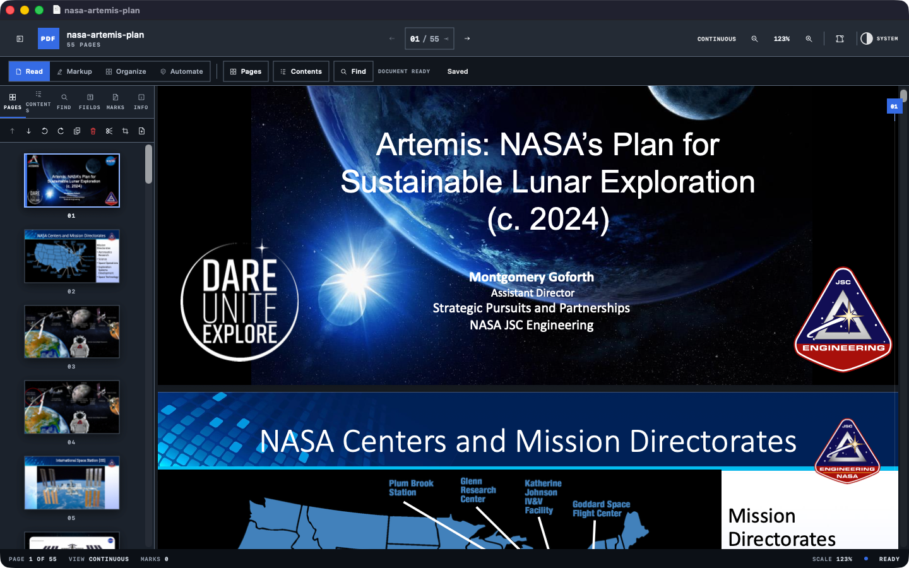
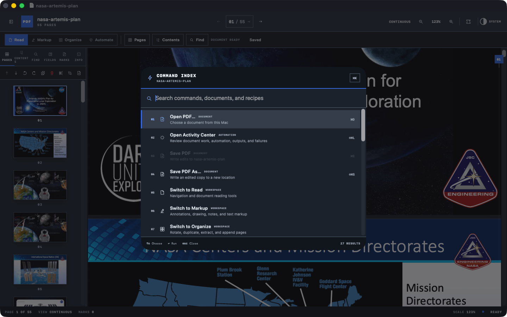
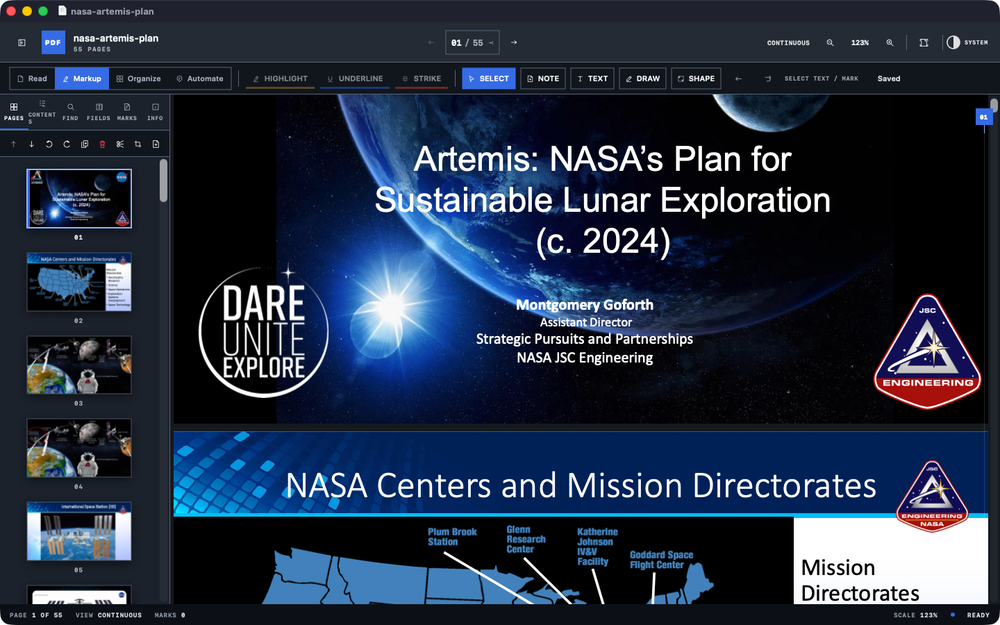
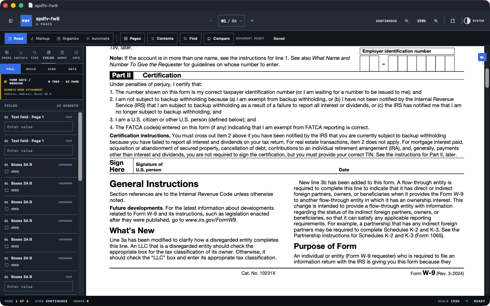

# SPDFV



SPDFV is a native PDF workspace for macOS. It opens quickly for ordinary reading, but keeps serious document work close at hand: annotations, page editing, forms, OCR, redaction, repeatable recipes, background jobs, and a command-line interface.

The interface is deliberately compact. It is not a web view in a desktop shell, and documents do not leave the Mac for routine processing.

[Project website](https://x3n.network/opensource/spdfv/) · [Download the current signed release](https://github.com/x3n-network/SPDFV/releases/latest) · [CLI reference](CLI/README.md)

## Current capabilities

- Open PDFs from Finder, the Open panel, recent documents, or drag and drop
- Work with several PDFs in independent windows
- Search text, browse outlines, and switch page layouts
- Highlight, underline, strike, draw, add notes, and place signatures
- Reorder, rotate, duplicate, extract, append, crop, and delete pages
- Inspect, fill, create, rename, and validate interactive form fields
- Exchange form values through a versioned JSON Data Studio with preflight validation and atomic undo
- Generate one completed PDF per CSV/TSV row with reusable alias mappings, filename templates, and all-rows preflight
- Preflight document protections and unlock password-protected PDFs without retaining the password
- Verify PDF ByteRanges and detached CMS signatures, inspect signer certificates and timestamps, evaluate macOS trust, and detect later document changes
- Audit metadata, review annotations, filled forms, attachments, and signatures before sharing without copying private values into the report
- Compare a working PDF with a reference using intelligent page alignment, configurable appearance tolerance and ignored regions, side-by-side/overlay/heatmap views, and exportable privacy-conscious reports
- Run Document Doctor for a prioritized health report, preview copy-safe OCR/form/metadata repairs, and verify a repaired copy against the original diagnosis
- Add an on-device searchable text layer to scanned pages with Vision OCR
- Create permanent rasterized redactions and verify forbidden text is absent
- Build, preview, and reuse versioned JSON recipes with parameters, conditional steps, form-data inputs, Compare and Doctor assertions, output naming, page editing, OCR, and deterministic validation
- Run recipe queues in the app, in the background, or through `spdfv`
- Use light, dark, or system appearance
- Print through the native macOS print panel

SPDFV is pre-release software. Keep an original copy of important documents while the editor is still being hardened. This README describes the current `main` branch; the signed build on the project website may trail capabilities that are awaiting the next release.

## Interface

### Command Index



### Markup workspace



### Interactive forms



Screenshots use public documents from [NASA](https://ntrs.nasa.gov/citations/20240011013) and the [IRS](https://www.irs.gov/forms-pubs/about-form-w-9).

## Requirements

- macOS 14 or later
- Xcode 26 or later for app development
- Swift 6 toolchain for the Core and CLI packages

## Build the app

Open `SPDFV.xcodeproj` in Xcode and run the `SPDFV` scheme, or build without signing from Terminal:

```sh
xcodebuild \
  -project SPDFV.xcodeproj \
  -scheme SPDFV \
  -configuration Debug \
  -destination 'platform=macOS' \
  CODE_SIGNING_ALLOWED=NO \
  build
```

The same MIT-licensed source tree also contains an `SPDFV Reader` target for the Mac App Store, published as **Simple PDF Viewer**. It supports the interactive PDF feature set—including creation, editing, annotations, forms, page organization, OCR, permanent redaction, comparison, and Document Doctor—while omitting Sparkle, the CLI, and workflow automation such as recipes, queues, folder watching, and background processing. See [the App Store build guide](docs/APP_STORE.md).

## Validate changes

Run the same repository audit, PDFKit round-trip smoke test, package tests, native app tests, and unsigned UI automation build used by CI:

```sh
bash Scripts/validate_project.sh
```

Use release optimization for Core and CLI when changing performance-sensitive PDF behavior or preparing a release:

```sh
bash Scripts/validate_project.sh --release
```

On a Mac where the test runner has Accessibility permission, execute the UI suite instead of only building it:

```sh
RUN_UI_TESTS=1 bash Scripts/validate_project.sh
```

Run only the focused performance measurements when iterating on large-document behavior:

```sh
swift test --package-path Core --filter PDFPerformanceTests
```

Build the CLI:

```sh
swift build --package-path CLI -c release
CLI/.build/release/spdfv help
```

Run the CLI integration tests:

```sh
swift test --package-path CLI
```

The full command reference and examples live in [CLI/README.md](CLI/README.md).

## Repository layout

```text
SPDFV/       macOS app and shared source for the App Store reader/editor target
SPDFVTests/  native app state-transition tests
SPDFVUITests/ critical document-flow UI automation
CompatibilityCorpus/ redistributable PDF compatibility fixtures and manifest
Core/        shared PDFKit operations and tests
CLI/         spdfv command-line executable
QueueRunner/ opt-in background queue helper
Scripts/     asset and development utilities
```

## Privacy

PDF reading, editing, OCR, redaction, recipes, and queue processing run locally. The app retains security-scoped bookmarks for files that you explicitly add to its queue. Those bookmarks are not written into exported queue files.

## Contributing

Start with [CONTRIBUTING.md](CONTRIBUTING.md). Small, well-tested changes are preferred; PDF behavior has enough edge cases without combining unrelated work.

## License

SPDFV is available under the [MIT License](LICENSE). Copyright (c) 2026 X3N LLC.
