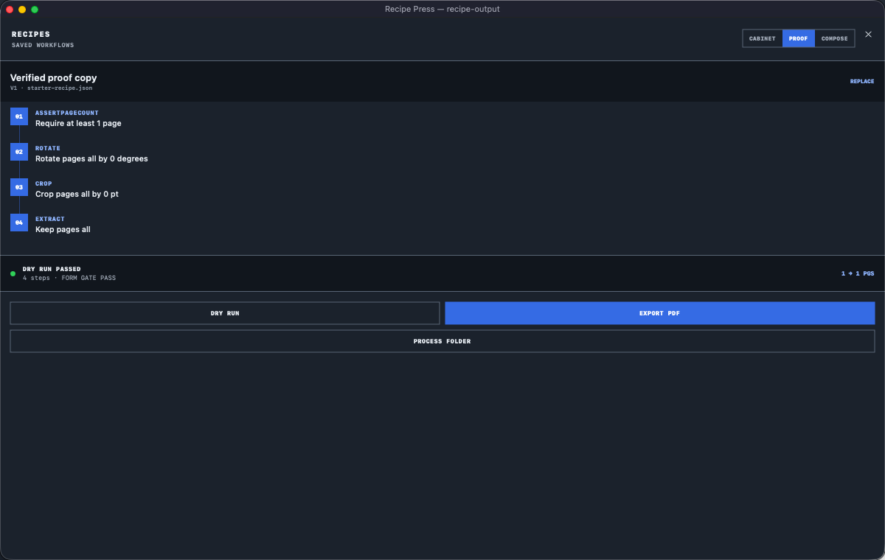
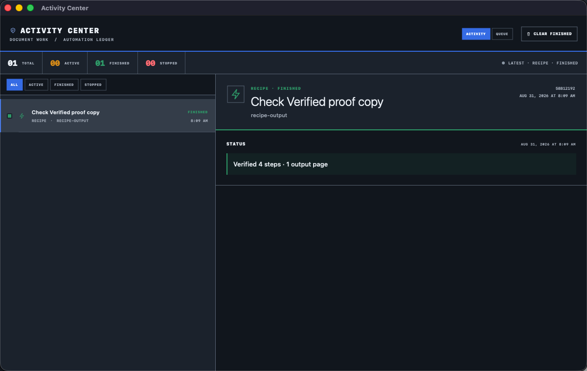

# SPDFV


SPDFV is a native PDF workspace for macOS. It opens quickly for ordinary reading, but keeps serious document work close at hand: annotations, page editing, forms, OCR, redaction, repeatable recipes, background jobs, and a command-line interface.

The interface is deliberately compact. It is not a web view in a desktop shell, and documents do not leave the Mac for routine processing.

## Current capabilities

- Open PDFs from Finder, the Open panel, recent documents, or drag and drop
- Work with several PDFs in independent windows
- Search text, browse outlines, and switch page layouts
- Highlight, underline, strike, draw, add notes, and place signatures
- Reorder, rotate, duplicate, extract, append, crop, and delete pages
- Inspect, fill, create, rename, and validate interactive form fields
- Add an on-device searchable text layer to scanned pages with Vision OCR
- Create permanent rasterized redactions and verify forbidden text is absent
- Save and reuse deterministic JSON recipes
- Run recipe queues in the app, in the background, or through `spdfv`
- Use light, dark, or system appearance
- Print through the native macOS print panel

SPDFV is pre-release software. Keep an original copy of important documents while the editor is still being hardened.

## Interface

### Document workspace


### Recipe Press



### Activity Center



## Requirements

- macOS 14 or later
- Xcode 26 or later for app development
- Swift 6 toolchain for the Core and CLI packages

## Build the app

Open `SPDFV.xcodeproj` in Xcode and run the `SPDFV` scheme, or build without signing from Terminal:

```sh
xcodebuild \
  -project SPDFV.xcodeproj \
  -scheme SPDFV \
  -configuration Debug \
  -destination 'platform=macOS' \
  CODE_SIGNING_ALLOWED=NO \
  build
```

Run the shared-core tests:

```sh
swift test --package-path Core
```

Build the CLI:

```sh
swift build --package-path CLI -c release
CLI/.build/release/spdfv help
```

The full command reference and examples live in [CLI/README.md](CLI/README.md).

## Repository layout

```text
SPDFV/       macOS app
Core/        shared PDFKit operations and tests
CLI/         spdfv command-line executable
QueueRunner/ opt-in background queue helper
Scripts/     asset and development utilities
```

## Privacy

PDF reading, editing, OCR, redaction, recipes, and queue processing run locally. The app retains security-scoped bookmarks for files that you explicitly add to its queue. Those bookmarks are not written into exported queue files.

## Contributing

Start with [CONTRIBUTING.md](CONTRIBUTING.md). Small, well-tested changes are preferred; PDF behavior has enough edge cases without combining unrelated work.

## License

SPDFV is available under the [MIT License](LICENSE). Copyright (c) 2026 X3N LLC.
